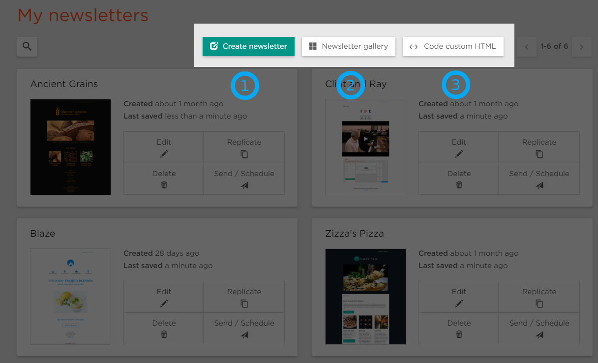

# Creating a Newsletter

## Newsletter Options

On the Newsletters page you can find three options for creating a newsletter:

1. **Create newsletter** uses our "Drag and Drop" editor to create an original newsletter 
2. **Newsletter gallery** allows you to choose a newsletter format from our gallery
3. **Code custom HTML** allows you create a newsletter using HTML.

## Basic Structure

<iframe src="https://player.vimeo.com/video/174626161" width="640" height="360" frameborder="0" webkitallowfullscreen mozallowfullscreen allowfullscreen></iframe>

## Rows & Columns

When creating a newsletter from scratch you’ll see a highlighted row from which you can choose the number of columns
in your row as well as the type of content for each block:

* Text
* Image
* Image/Text
* Button
* Map
* Video
* Calendar
* Image grid
* Divider
* Eventbrite

## Adding a row

You can add another row by either clicking the **+** in the "Row Editor" or by clicking "Add new row" button in the "Row Properties" panel on the left. 
From the "Row Properties" panel, new rows will be added to the top of the newsletter. 
From the "Row Menu" they will be immediately added above the current row.

# Setting the Content Type

Upon entering the editor you’ll find a single row highlighted with a "Set Content Type" button which essentially forces you to 
choose from the content options on the left.

# Content Structure

<iframe src="https://player.vimeo.com/video/174626725" width="640" height="360" frameborder="0" webkitallowfullscreen mozallowfullscreen allowfullscreen></iframe>

 
## Row Content
 
The editor is structured by rows with one to four content blocks. If a block is selected, you’ll see the row edit menu above.
When you click on a specific block you will also see a corresponding edit menu below, which will vary based on the content of the row.
 
## Content Blocks
 
Easily resize blocks by dragging to the desired size. Align content using the padding control in the properties panel to adjust
spacing within the block.
 
