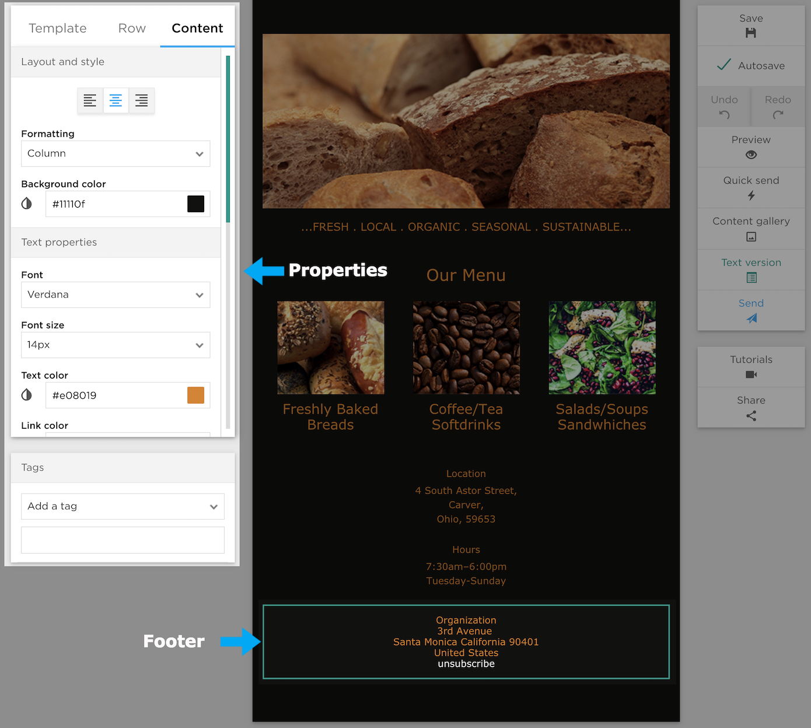

# Footer

The Footer contains your address which is a requirement per the CAN/SPAM act. 
The address in the footer should reflect the actual physical address of the sender. 

## How to Change the Physical Address in the Footer

Addresses are list-specific and can be changed under _Contacts_ by clicking _Properties_ on the desired list, 
then finally clicking _Physical Address_ from the left column on that screen.

## Unsubscribe Link

The unsubscibe link in the footer can not be removed.
