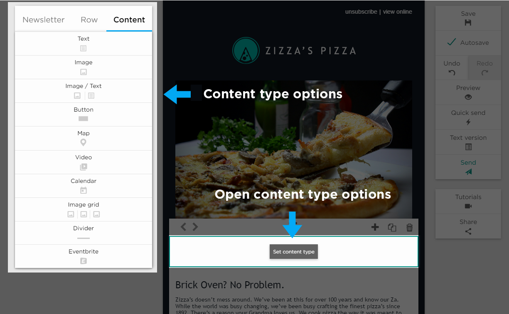

# Setting the Content Type

Upon entering the editor you’ll find a single row highlighted with a _Set Content Type_ button which essentially forces you to 
choose from the content options on the left.
