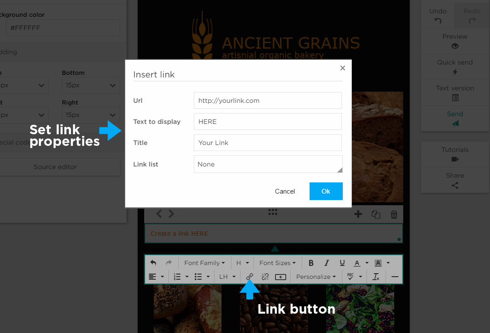

# Adding Links

## How to Add a Text Link

To add a link to your newsletter simply click the link button in the local editor which will open up the _Insert Link_ window. 
Here you can enter the desired URL, the text to display, the title (which will display when hovered over) 
as well as the type of link (link list).

## How to Add and Email Link

To set a link to an email address simply type “mailto:” followed immediately by the desired email address into the URL field. 
