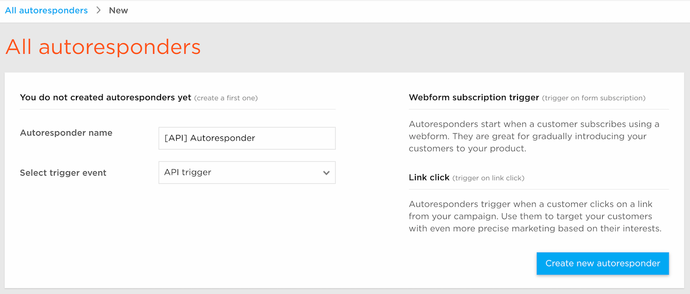
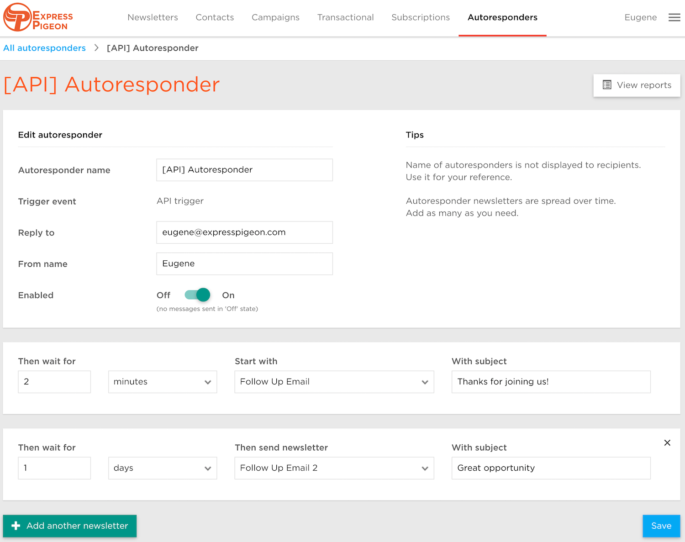

## API trigger Autoresponders

You control with our API when to trigger autoresponders. Use them to target your customers with even more precise marketing based on their interests.

### Create Autoresponder with API trigger

Go to Autoresponders page and click 'Create new autoresponder' button. Please note that if you don't have any autoresponders, you will need to enter Autoresponder name and trigger before you can proceed: 

After you entered basic information, you will be able to configure autoresponder rules and details:

Let check what options you can control:

* **Trigger Event** - can't be changed since you selected on the first step API trigger. Go to [this article](../api/autoresponders.md) to read more about our API.
* **Reply to** - Email to reply to. Subscribers will be sending email to this address if they click 'reply to' button.
* **From name** - Name of sender (your or your organization). Subscribers will see emails as coming from this name.
* **Enabled** - switcher that allows you to simply enable/disable autoresponder.
* **Rules** - allow you configure as many as you want autoresponder messages. 
    * Then wait for - amount of time you want us to wait before sending follow up email
    * Start with - your newsletter template you want to be sent
    * With Subject - follow up emai lsubject

On the screenshot above, after you will make an [API call](../api/autoresponders.md) for autoresponder, we will wait for 2 hours and then send first autoresponder email with subject 'Thanks for joining us!'. After 1 more day second email will be automatically sent with subject 'Great opportunity'. 

