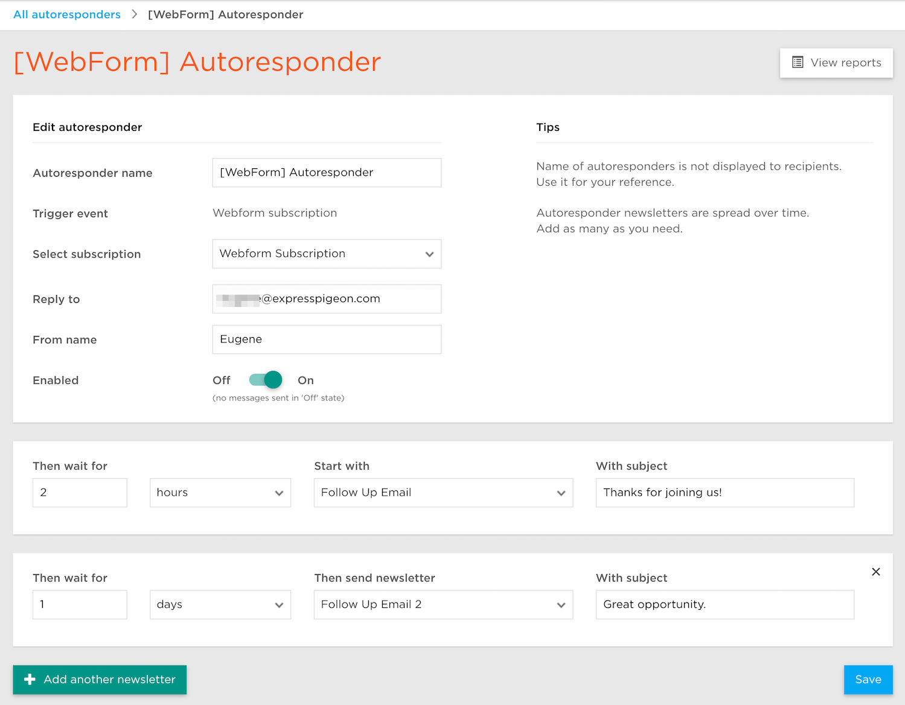

## Webform Subscription Autoresponders

Autoresponders start when a customer subscribes using a webform. They are great for gradually introducing your customers to your product.

### Create Autoresponder with Webform subscription trigger

Before you start, please make sure you have at least one webform subscription created. !!!!TODO -> ADD LINK TO THIS ARTICLE HERE!!!!!
Go to Autoresponders page and click 'Create new autoresponder' button. Please note that if you don't have any autoresponders, you will need to enter Autoresponder name and trigger before you can proceed: 

After you entered basic information, you will be able to configure autoresponder rules and details:

Let check what options you can control:

* **Select Subscription** - select subscription that you want use as a trigger. Go to [this article](!!!!ADD CORRECT LINK HERE!!!) to read more about webform subscriptions.
* **Reply to** - Email to reply to. Subscribers will be sending email to this address if they click 'reply to' button.
* **From name** - Name of sender (your or your organization). Subscribers will see emails as coming from this name.
* **Enabled** - switcher that allows you to simply enable/disable autoresponder.
* **Rules** - allow you configure as many as you want autoresponder messages. 
    * Then wait for - amount of time you want us to wait before sending follow up email
    * Start with - your newsletter template you want to be sent
    * With Subject - follow up emai lsubject

On the screenshot above, after someone used your subscription webform, we will wait for 2 hours and then send first autoresponder email with subject 'Thanks for joining us!'. After 1 more day second email will be automatically sent with subject 'Great opportunity'. 

