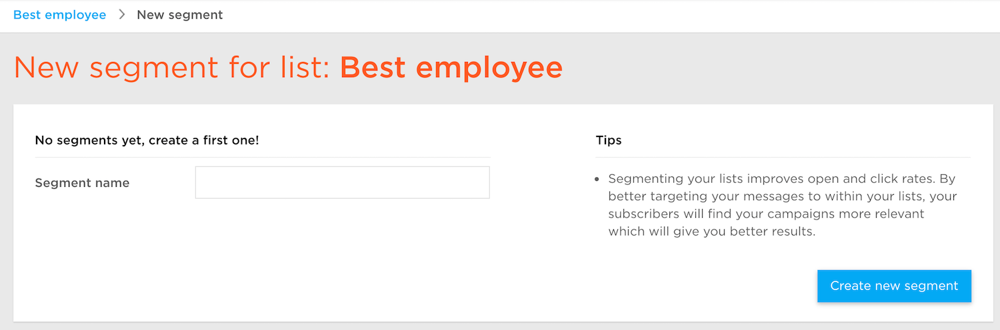

# Segments

<ul data-toc data-toc-headings="h2,h3,h4"></ul>

Segments allow you to create contacts lists based on pre-configured rules. ExpressPigeon has bunch of available conditions for you. Couple examples of how flexible segments are:

* 'First Name' **starts with** 'Do'
* 'First Name' **starts with** 'Do' **or** 'First Name' **starts with** 'Ma' **and** 'clicked' **before** '02/28/2017' **or** 'opened' **on date** '02/22/2017'

These rules will return you matching contacts, which you can use for creating new lists or adding to existing. Do not be afraid of these conditions, our UI allows you to do this really simple. Here is how these rules looks like:

Below you can find information how to create segments and how they work. 

## Segments Page

Open 'Contacts' page and click 'Segments' button for list that you want to use. If you don't have any configured segments for this list, you will see form for creating new segment:

If you have created segments already, you will see page with all segments from the selected list:

### Create Segment

From 'Segments' page click 'Create new segment' button. Enter segment name and click 'Create new segment' button. You will see page for configuring your segment:

 

'Rule Set' fields are based on 'standard' and 'custom' fields available for your contacts and on specific conditions, our system allow to use for different type of fields. For example, for *text* fields you can use:

* is
* is not
* exists
* does not exist
* contains
* does not contain
* starts with
* ends with
* does not start with
* does not end with

For fields with type *date*, you can see:

* on date
* before
* after

Also you can use **or** operator in your rule set or you can create new rule set using **and** operator. 

After you complete with rules, click 'Save' button.

### Add to existing list 

You are able to add segmented contats to the existing contacts list. Open your segment and click 'Add to existing list' button:

Dialog window will appear where you can select any contact list. Contacts that are result of this segmentation will be added to the selected list.

### Add to a new list

You are able to add segmented contacts to brand new contacts list. Open your segment and click 'Add to a new list' button:

Dialog window will appear where you can enter name for new list, 'from' and 'reply to' values. 
