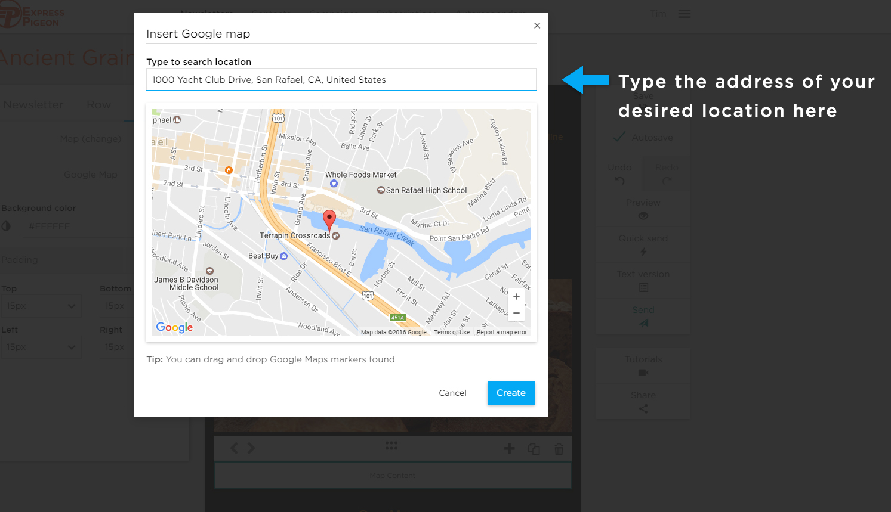

# Insert Google Map

* [How to Add a Google Map](#how-to-add-a-google-map)

<iframe src="https://player.vimeo.com/video/174627936" width="640" height="360" frameborder="0" webkitallowfullscreen mozallowfullscreen allowfullscreen></iframe>

## How to Add a Google Map

You can add a map by setting content type to Map. When the _Insert Google Map_ window opens simply type in the address and 
click the Create button. Your map will be inserted into the chosen block.

