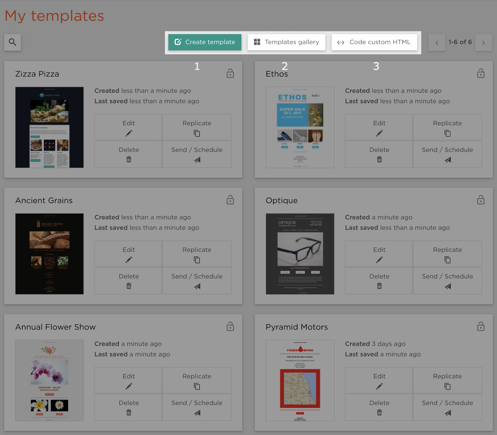
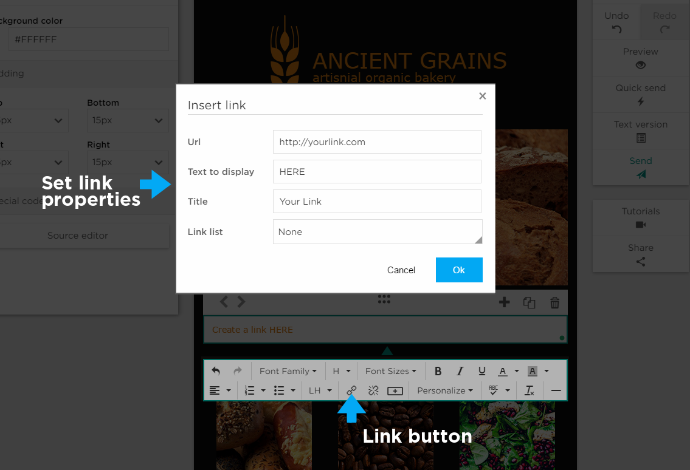

# Creating and editing newsletters

<ul data-toc data-toc-headings="h2,h3,h4"></ul>

## Newsletter Options

On the Newsletters page you can find three options for creating a newsletter:

1. **Create newsletter** uses our "Drag and Drop" editor to create an original newsletter 
2. **Newsletter gallery** allows you to choose a newsletter format from our gallery. Don't worry, you will be able to mold it to your liking using our editor.
3. **Code custom HTML** allows you create a newsletter using HTML (experts only).

## Picking from Template Gallery

Easily select your desired template by either clicking on the thumbnail or clicking the edit button.

We have a large collection of professional looking templates for all styles. Simply click on our Newsletter Gallery
and choose the template that best fits you.

<iframe src="https://player.vimeo.com/video/174627397" width="640" height="360" frameborder="0" webkitallowfullscreen mozallowfullscreen allowfullscreen></iframe>

## Basic Structure

Watch a short video to learn a basic editor structure.

<iframe src="https://player.vimeo.com/video/174626161" width="640" height="360" frameborder="0" webkitallowfullscreen mozallowfullscreen allowfullscreen></iframe>

## Rows & Columns

When creating a newsletter from scratch you’ll see a highlighted row from which you can choose the number of columns
in your row as well as the type of content for each block:

* [Text](editor_setting_content_text)
* Image
* [Image/Text](editor_setting_content_as_image_text)
* [Button](editor_setting_the_content_as_button)
* [Google Map](editor_adding_google_map)
* [Video](editor_adding_youtube_video)
* [Calendar](editor_adding_calendar_widget)
* [Image grid](editor_adding_social_buttons)
* Divider
* Eventbrite

## Adding a row

You can add another row by either clicking the **+** in the "Row Editor" or by clicking "Add new row" button in the "Row Properties" panel on the left. 
From the "Row Properties" panel, new rows will be added to the top of the newsletter. 
From the "Row Menu" they will be immediately added above the current row.

## Setting the Content Type

Upon entering the editor you’ll find a single row highlighted with a "Set Content Type" button which essentially forces you to 
choose from the content options on the left.

## Content Structure

<iframe src="https://player.vimeo.com/video/174626725" width="640" height="360" frameborder="0" webkitallowfullscreen mozallowfullscreen allowfullscreen></iframe>

### Row Content

The editor is structured by rows with one to four content blocks. If a block is selected, you’ll see the row edit menu above.
When you click on a specific block you will also see a corresponding edit menu below, which will vary based on the content of the row.

### Content Blocks
 
Easily resize blocks by dragging to the desired size. Align content using the padding control in the properties panel to adjust
spacing within the block.
 

## Moving Content

<iframe src="https://player.vimeo.com/video/174627145" width="640" height="360" frameborder="0" webkitallowfullscreen mozallowfullscreen allowfullscreen></iframe>

## Undo / Redo

No matter how far you proceed into a single session, our _Undo_ button will take you all the way back to the beginning of that session.
This is great feature is unique to the ExpressPigeon editor.

## Adding Links

### How to Add a Text Link

To add a link to your newsletter simply click the link button in the local editor which will open up the _Insert Link_ window.
Here you can enter the desired URL, the text to display, the title (which will display when hovered over)
as well as the type of link (link list).

### How to Add and Email Link

To set a link to an email address simply type “mailto:” followed immediately by the desired email address into the URL field.

## Adding Images

<iframe src="https://player.vimeo.com/video/174627797" width="640" height="360" frameborder="0" webkitallowfullscreen mozallowfullscreen allowfullscreen></iframe>

### How to Add Images

In any content block choose Image for content type and your image gallery will open.
Simply select the image you want to insert into the block.

### Image Gallery

To add images to the Image Gallery simply drag and drop them into the top of the Gallery, or click the
_Browse_ button on the right to browse for files.

