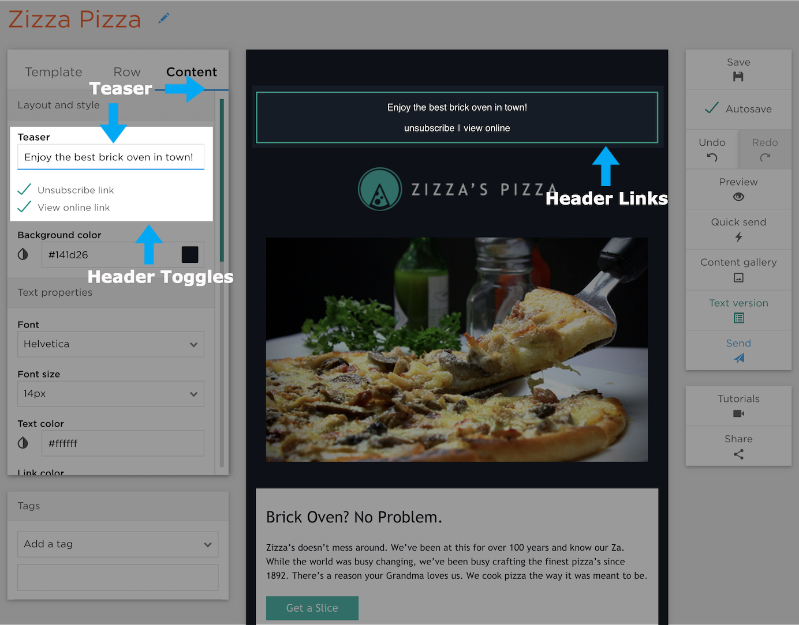
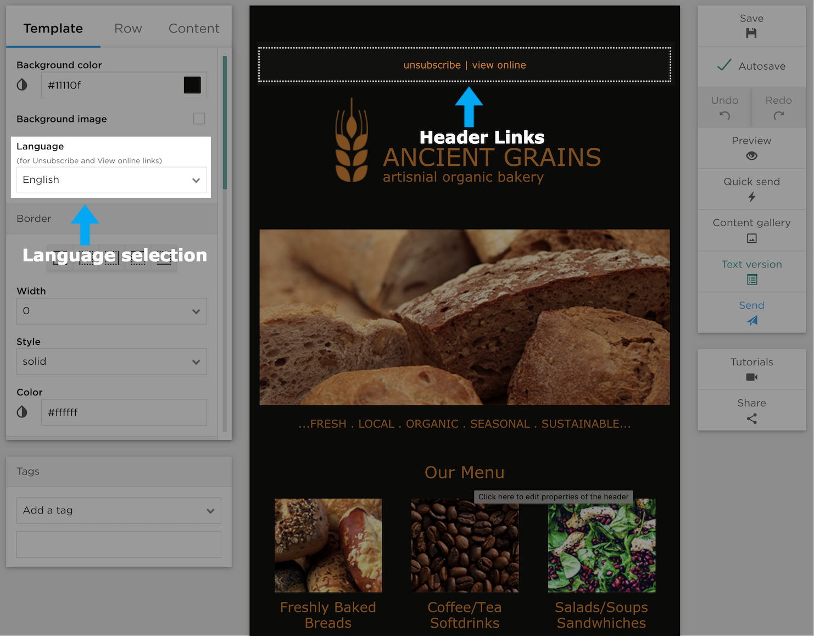

# Editor Layout

## Header

When you click on the Header you'll see your header links on the right hand side of the block and your Teaser on the left. You can set the
Teaser, as well as, toggle the links in the properties panel on the left.

### Unsubscribe Links

The CAN/SPAM act requires unsubscribe links in all bulk emails, and requires that any person who chooses to unsubscribe be
removed from the list within 10 days. ExpressPigeon removes all unsubscribes immediately.
Transactional messages do not require unsubscribe links as they are considered important system updates.

### View Online Link

The View Online link allows the user to display the email in a web browser in the event that there’s a problem with their email client.
Everything in the browser view will display exactly as you would see it in your email. The view online link can be toggled
on and off in the editor.

### Location of Unsubscribe Links

When creating a newsletter, the unsubscribe link will be present in the header, as well as, the footer. The unsubscribe link in the
header can be disabled (as shown below), but do to CAN/SPAM the unsubscribe link in the footer cannot.
ExpressPigeon recommends making unsubscribing as easy as possible by keeping both which will ultimately have a positive impact on
deliverability.

## Setting the Language

In the Row Properties Panel you can set the language for your Unsubscribe/View Online links.
This not only changes the language of the visible links, but also the entire unsubscribe flow.
If a recipient gets an email with a Chinese unsubscribe link and clicks it, the recipient will then be taken to an ExpressPigeon
unsubscribe page which will tell them, in Chinese, that they’ve unsubscribed.

## Row Menu

Above any selected block you'll find a row editor where you can make up/down/left/right adjustments, add a new row, copy the row, or
delete the row.

## Footer

The Footer contains your address which is a requirement per the CAN/SPAM act.
The address in the footer should reflect the actual physical address of the sender.

## Physical Address in the Footer

Addresses are list-specific and can be changed under _Contacts_ by clicking _Properties_ on the desired list,
then clicking _Physical Address_ from the left column on that screen.

## Unsubscribe Link

The unsubscibe link in the footer can not be removed  in order to comply with CAN SPAM Act.
If you have a *very* good reason to remove it,
please send a [support request](https://expresspgieon.com/support).

## Global and Local Styles

Within the editor you can set Global Styles that affect the whole newsletter as well as Local Styles for individual blocks.
Local Styles always override Global Styles.

### Global Styles

The Newsletter tab in the Properties Panel is a global style editor. Here you can set standards for the entire newsletter
as well as things like background color, background image, etc.

### Local Styles

The Local Editor is displays directly beneath a currently active row where you can make edits to specific blocks
without affecting the entire newsletter.
