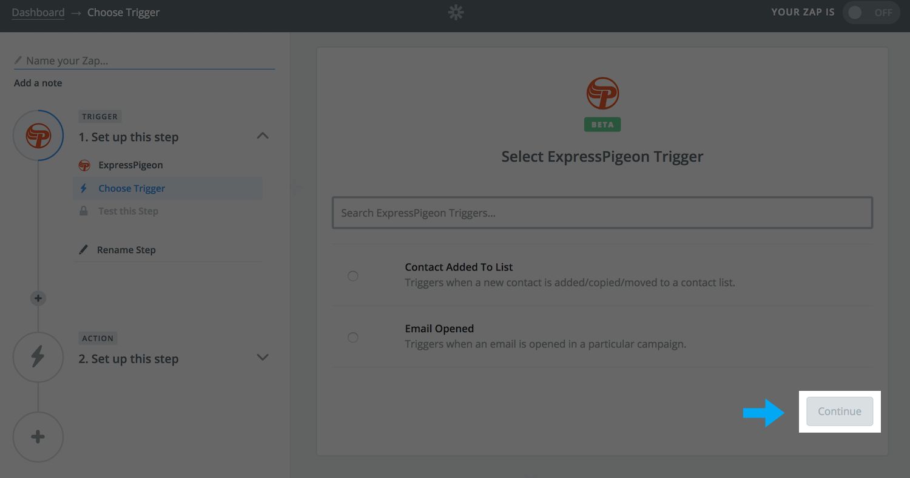
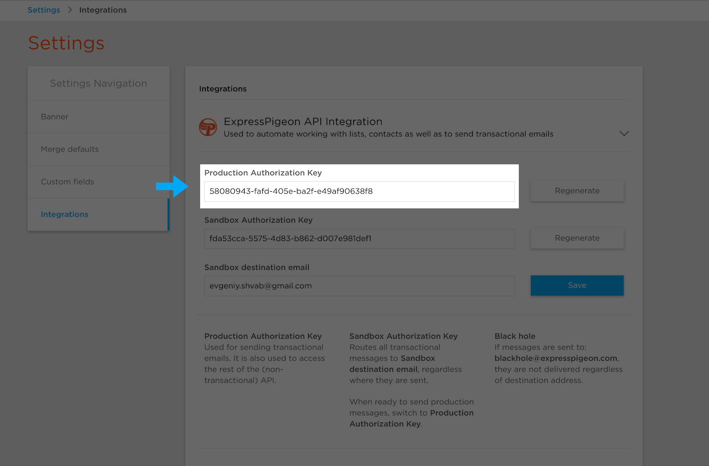

# Zapier

* [Introduction](#Introduction)
* [Picking from Template Gallery](#picking-from-template-gallery)

## Introduction

Zapier is a tool which allows users to connect together web apps.

An integration between two apps is called a Zap. A Zap is made up of a **Trigger** and one or more **Actions** or **Searches**.

Whenever the trigger happens in one app, Zapier will automatically perform the actions or searches in another app in order.

Here are couple examples:

* Get notifications in Slack when someone opened an email from chosen ExpressPigeon campaign
* Add new Salesforce Leads to an ExpressPigeon contact list
* Send emails via ExpressPigeon to abandoned Shopify cart users

## What ExpressPigeon Triggers and Actions are Supported?

### Supported Triggers

* Contact Added To List - Triggers when a new contact is added/copied/moved to a contact list.
* Email Opened - Triggers when an email is opened in a particular campaign.

### Supported Searches

* None yet!

### Supported Actions

* Suppress Contact - Removes a contact from all lists.
* Create/Update Contact - Add a new contact to a list, or updates an existing contact.
* Send Transactional Email - Sends an e-mail using an existing template.

## How to connect ExpressPigeon on Zapier

To get started with ExpressPigeon on [Zapier](https://zapier.com), click 'Make A Zap!' button.

TODO: enter image with arrow to this button 

In the 'Choose a trigger app' field enter 'ExpressPigeon' and select it.

TODO: enter image with arrow to this field

As result you will see our list of available Triggers. Select Trigger that you plan to use and click 'Continue' button.

TODO: enter image with arrow to this field

At this stage you will need to connect you ExpressPigeon account. Click 'Connect a new account' button. You should see new dialog window where you need to enter ExpressPigeon API key.

TODO: enter image with arrow to this field

ExpressPigeon API key can be found on our [Integrations apge](https://expresspigeon.com/settings/integrations).

TODO: enter image with arrow to this field

After entered API key and applied it, you should see 'ExpressPigeon Account #1' and 'Test' button at the right side.

TODO: enter image with arrow to this button

Click 'Test' button and if you will get 'Success!' this means you are all set and can proceed with configuring you zap.

## Image

Images need to be:

* Scaled down to the width of layout.
* You need to implement something so that when an image is clicked, the user will see the image at 100% resolution.
It might be a dialog. Is there anything in Bootstrap or material Framework for this?

