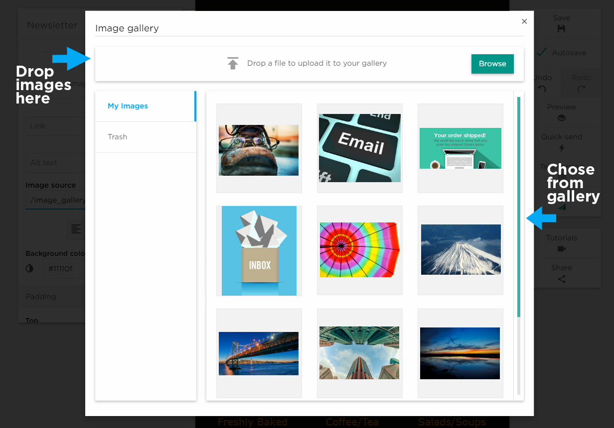

# Setting the Content as Image

After hitting Set content type in a selected block and selecting Image, your Image gallery will open. 
From here you can select an existing image, browse for an image on your computer, or simply drag and drop the image you want to upload 
and add.
