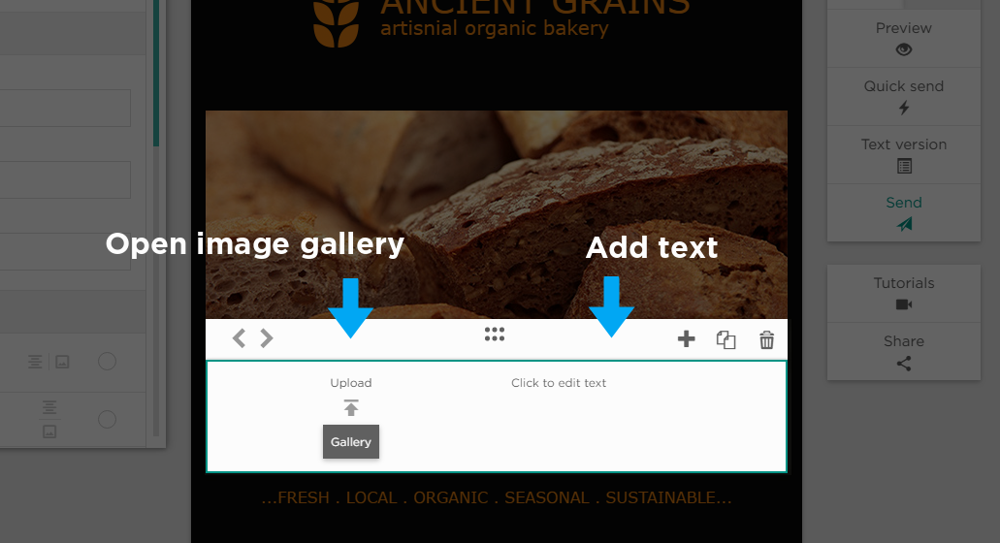

# Setting the Content as Image/Text

When you set the content type as Image / Text the selected block will populate with two items. On the left you will be able to open 
the Gallery as outlined here (link this to “Setting the content as Image”). On the right you’ll be able to click to add text as 
outlined here (link this to Setting the content as Text”)
