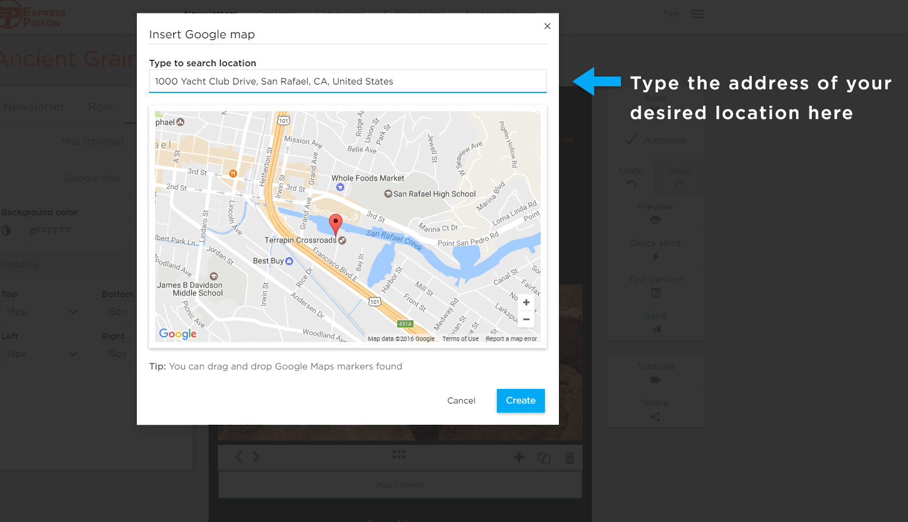

# Setting the Content type to Map

Setting the Content type to Map within your chosen block will open the _Insert Google Map_ window. 
Simply enter the address of your chosen location and hit _Create_, the map will then populate in the block.
